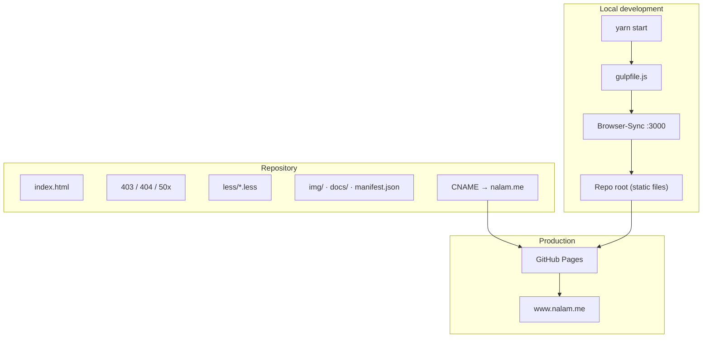
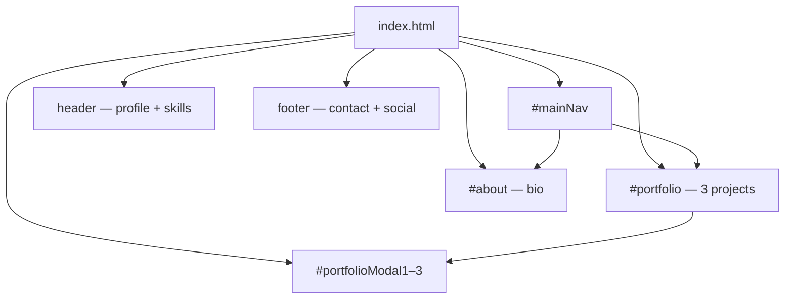

# nalam.me

Personal portfolio for [Nazmul Alam](https://www.nalam.me). Static HTML site based on [Start Bootstrap Freelancer](https://startbootstrap.com/template/freelancer), hosted on **GitHub Pages** with custom domain **`nalam.me`**.

## For Cursor / AI agents

Read **`AGENTS.md`** first for editing conventions, file map, and constraints. Cursor rules live in **`.cursor/rules/`**.

## Architecture



### Page structure

Single-page layout in `index.html` — hash navigation and Bootstrap modals, no SPA framework.



### External assets (CDN)

Production CSS/JS comes from CDNs, not from a local build:

| Layer | Source |
|-------|--------|
| Grid / components | Bootstrap 3.3.7 |
| Theme | startbootstrap-freelancer 3.3.7 |
| Icons | Font Awesome 4.7, font-mfizz |
| Fonts | Google Fonts (Montserrat, Lato) |
| Scripts | jQuery 3.2.1, jquery.easing, Freelancer JS |
| Analytics | Google Analytics + GTM |

> **Note:** `less/` holds theme source files but Gulp does **not** compile them. The live site uses CDN Freelancer CSS. See [Styling](#styling) below.

## Repository layout

```
naz-mul.github.io/
├── index.html          # Main portfolio page (all content)
├── 403.html            # Forbidden error page
├── 404.html            # Not found error page
├── 50x.html            # Server error page
├── CNAME               # Custom domain (nalam.me)
├── gulpfile.js         # Dev server + live reload
├── package.json        # Yarn scripts and devDependencies
├── less/
│   ├── variables.less  # Colour tokens
│   ├── mixins.less
│   └── freelancer.less # Theme overrides (not auto-compiled)
├── img/                # Profile and portfolio images (referenced by index.html)
├── docs/               # Resume PDF (optional)
├── .cursor/
│   └── rules/          # Cursor AI rules (.mdc)
├── .vscode/
│   ├── launch.json     # Run & Debug: open site in Chrome
│   ├── tasks.json      # Gulp dev server tasks
│   └── settings.json
├── AGENTS.md           # Agent / Cursor context
└── README.md           # This file
```

## Prerequisites

- [Node.js](https://nodejs.org/) (LTS recommended)
- [Yarn](https://yarnpkg.com/) ≥ 1.19.1 — **npm is intentionally blocked** (`engines.npm`: `please-use-yarn`)

## Development

### Install dependencies

```bash
yarn ci
```

Runs a clean frozen lockfile install. `postinstall` automatically runs `yarn start` (dev server).

Verify an existing install:

```bash
yarn verify
```

### Run locally

```bash
yarn start
```

Starts Gulp + Browser-Sync, serves the repo root, and reloads on changes to `*.html` and `less/*.less`.

Default URL: **http://localhost:3000**

### VS Code / Cursor run config

| Action | How |
|--------|-----|
| **Run and Debug** | Choose **"Open nalam.me (Browser-Sync)"** — starts the dev server, then opens Chrome |
| **Attach only** | Choose **"Attach: already running dev server"** if `yarn start` is already running |
| **Tasks** | `Terminal → Run Task` → `dev: Browser-Sync` (default build task) |

## Styling

Two parallel paths exist today:

1. **What users see:** CDN links in `index.html` (Bootstrap + Freelancer min CSS).
2. **Local source:** `less/` mirrors the Freelancer theme for customisation.

To apply `less/` changes you must add a LESS compile step to Gulp (or another tool) and link the output CSS in `index.html`. Until then, edit appearance via CDN behaviour or inline additions only.

Theme tokens in `less/variables.less`:

- `@theme-primary`: `#2C3E50`
- `@theme-success`: `#18BC9C`

## Deployment

Push to the `naz-mul.github.io` repository; **GitHub Pages** publishes the default branch. `CNAME` points the site at `nalam.me`.

No build step is required for deploy — static files are served as-is.

## Common tasks

| Task | Where |
|------|-------|
| Update bio or copy | `index.html` → `#about` |
| Add / edit a project | `index.html` → `#portfolio` + modal block at bottom |
| Change contact or social links | `index.html` → `footer` |
| Custom error pages | `403.html`, `404.html`, `50x.html` |
| Profile / portfolio images | `img/` |
| Resume download | Uncomment block in `#about`; file at `docs/naz-resume.pdf` |

## Portfolio projects (current)

| Modal | Project | Links |
|-------|---------|-------|
| `portfolioModal1` | Sitar Player | [Play Store](https://play.google.com/store/apps/details?id=com.nazmulalam.sitarplayer), [GitHub](https://github.com/naz-mul/sitar) |
| `portfolioModal2` | SupremeBot | [GitHub](https://github.com/naz-mul/supremebot) |
| `portfolioModal3` | Datagram FTP | [GitHub](https://github.com/naz-mul/datagram-ftp) |

## License

MIT — see `package.json`.
